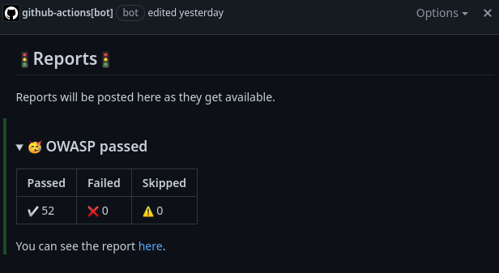
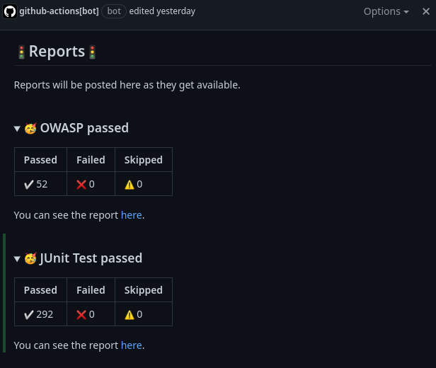
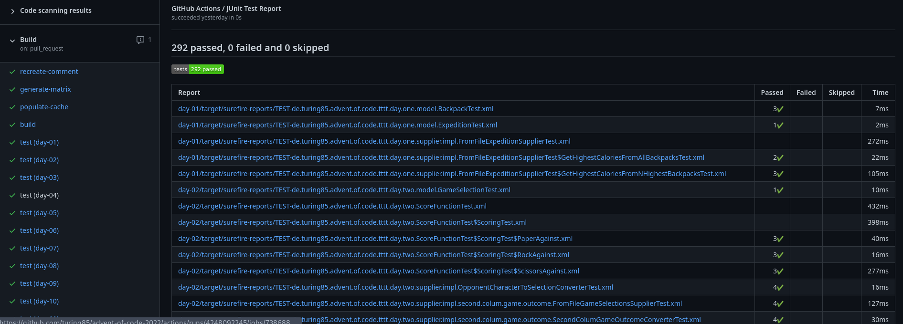
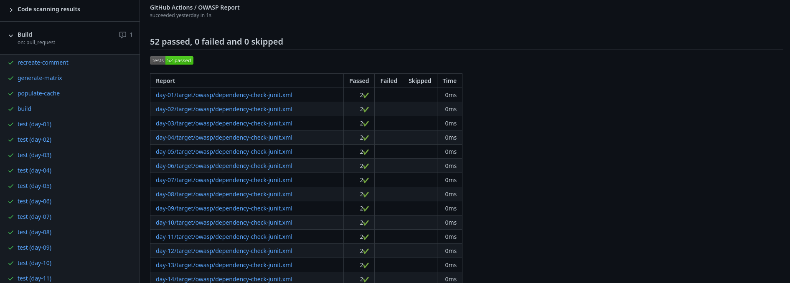

[](https://github.com/turing85/publish-report/blob/main/LICENSE)

# Github action to publish reports

This action allows us to publish reports as github-actions check and produce comments on Pull requests with a summary of
the report.

By identifying comments through `comment-header` (which will be transformed to an invisible `html` comment, containing the `comment-header` to identify comments controlled by this action), we can update an existing comment, adding more information as new reports get available over the run of a workflow.


## Components
This action is a composite action, it uses the following actions:

<table>
  <tr>
    <th>Action</th>
  </tr>

  <tr>
  <td>

[`actions/checkout@v4`][checkout]

  </td>
  </tr>

  <tr>
  <td>

[`marocchino/sticky-pull-request-comment@v2`][comment]

  </td>
  </tr>

  <tr>
  <td>

[`actions/download-artifact@v4`][download]

  </td>
  </tr>

  <tr>
  <td>

[`phoenix-actions/test-reporting@v14`][report]

  </td>
  </tr>

<tr>
  <td>

[`andymckay/cancel-action@0.5`][cancel]

  </td>
  </tr>
</table>

## Quick reference
### Permission setup (for personal repositories)
```yaml
name: My Workflow
...
permissions:
  actions: write       # Necessary to cancel workflow executions
  checks: write        # Necessary to write reports
  pull-requests: write # Necessary to comment on PRs
...
```

### Post initial comment
This snippet will post a comment with the given `comment-header` to the PR that triggered the workflow execution. Any existing comments with the same `comment-header` will be hidden as `OUTDATED`:

```yaml
jobs:
  ...
  recreate-comment:
    runs-on: ubuntu-latest

    steps:
      - name: Publish Report
        uses: turing85/publish-report@v2
        with:
          checkout: 'true'
          comment-header: my-comment-header
          comment-message-recreate: Hello
          recreate-comment: true
  ...
```

### Generate test report and append message to existing comment
The report will be generated from the files selected by the glob pattern in `pattern-path`. The name of the report will be `report-name` + `" Report"`.

If all tests succeeded, the message `comment-message-success` will be appended to the comment with the given `comment-header`. If tests failed, the message in `comment-message-failure` will be appended to the comment with the given `comment-header`.

We set the execution of the `Publish Report` step to `if: ${{ always() }}` so that it is also executed when tests fail (and we get a report).

```yaml
jobs:
  ...
  test:
    runs-on: ubuntu-latest

    steps:
      - name: Git checkout
        uses: actions/checkout@v4
      ...
      - name: Run Tests
        ...
        continue-on-error: true # the publish step will fail, so we get a report when tests failed as well
        ...
      ...
      - name: Publish Report
        uses: turing85/publish-report@v2
        if: ${{ always() }}
        with:
          # cancel-workflow-on-error: 'false' # If we do not want to cancel the whole workflow execution on error
          # checkout: 'true' # not needed; project is already checked out 
          comment-header: my-comment-header
          comment-message-success: |
            YAY! {0} passed!  
            
            {1} tests were successful, {2} tests failed, {3} test were skipped.
            
            The report can be found [here]({4}).

          comment-message-failure: |
            On no! {0} failed!  

            {1} tests were successful, {2} tests failed, {3} test were skipped.

            The report can be found [here]({4}).
          report-fail-on-error: true # to fail when tests failed
          report-name: Tests
          report-path: '**/target/surefire-reports/TEST*.xml'
          report-reporter: java-junit
  ...
```

### Generate test report from a downloaded artifact and append message to existing comment
When we have a scenario where we cannot or do not want the report generation the same job as the test, we can upload the test artifacts via [`actions/upload-artifact`][upload]. We can then execute report generation in a separate step, downloading said test artifacts.

Notice that the `name` and `path` used in action `actions/upload-artifact` correlates with `download-artifact-name` and `report-path` in action `turing/publish-report`. 

We should configure the `test` job so that it does not fail when tests fail. This guarantees  that the `test-report` job is executed, and can fail (as long as `report-fail-on-error` is not set to `'false'`).

```yaml
...
jobs:
  ...
  test:
    runs-on: ubuntu-latest

    steps:
      - name: Git checkout
        uses: actions/checkout@v4
      ...
      - name: Run Tests
        ...
      ...
      - name: Upload test artifacts
        uses: actions/upload-artifact@v4
        if: ${{ always() }}
        with:
          name: test-report
          path: '**/target/*-reports/TEST*.xml'
          if-no-files-found: error
          retention-days: 2

  test-report:
    runs-on: ubuntu-latest
    
    needs:
      ...
      - test
      ...

    steps:
      - name: Publish Report
        uses: turing85/publish-report@v2
        with:
          ...
          checkout: true
          ...
          download-artifact-name: test-report
          report-path: '**/target/surefire-reports/TEST*.xml'
          ...
  ...
```

### Complex example
For a complex example please take a look at the [workflow of `github.com/turing85/advent-of-code-2022`][advent-workflow]

## Inputs

<table>
  <tr>
  <th>Name</th><th>semantics</th><th>Required?</th><th>default</th>
  </tr>

  <tr>
  <th colspan="4" align="center">General Inputs</th>
  </tr> 

  <tr>
  <td>

`cancel-workflow-on-error`
  </td>
  <td>Whether the entire current workflow should be cancelled on error (i.e. when tests failed).</td>
  <td>✅</td>
  <td>

`'false'`
  </td>
  </tr>

  <tr>
  <td>

`checkout`
  </td>
  <td>Whether a checkout should be performed</td>
  <td>✅</td>
  <td>

`'false'`
  </td>
  </tr>

  <tr>
  <th colspan="4" align="center">Comment-related Inputs</th>
  </tr> 

  <tr>
  <td>

`recreate-comment`
  </td>
  <td>Triggers the (re-)creation of the comment in a PR, that is updated with the reports.</td>
  <td>✅</td>
  <td>

`'false'`
  </td>
  </tr>

  <tr>
  <td>

`comment-enabled`
  </td>
  <td>Whether a comment on the PR should be posted.</td>
  <td>✅</td>
  <td>

`'true'`
  </td>
  </tr>

  <tr>
  <td>

`comment-header`
  </td>
  <td>The header to identify the PR comment. This is an invisible tag on the comment.</td>
  <td>✅</td>
  <td>

`reports`
  </td>
  </tr>

  <tr>
  <td>

`comment-message-failure`
  </td>
  <td>

Message appended to the comment posted on the PR after the tests failed.

The message can be templated for replacement. The [format feature of github-expressions][github-expressions] is used to replace placeholders. The following placeholder-mapping applies:
- `{0}` is `inputs.report-name`
- `{1}` is the number of successful tests
- `{2}` is the number of failed tests
- `{3}` is the number of skipped tests
- `{4}` is the URL to the HTML-Report
  </td>
  <td>✅</td>
  <td>

```markdown
<details>
  <summary><h3>😔 {0} failed</h3></summary>

  | Passed | Failed | Skipped |
  |--------|--------|---------|
  | ✅ {1} | ❌ {2} | ⚠️ {3}   |

  You can see the report [here]({4}).
</details>
```
  </td>
  </tr>

  <tr>
  <td>

`comment-message-recreate`
  </td>
  <td>Initial text for the comment posted on the PR. Subsequent messages will be appended.</td>
  <td>✅</td>
  <td>

```markdown
## 🚦Reports for run [#${{ github.run_number }}](${{ github.server_url }}/${{ github.repository }}/actions/runs/${{ github.run_id }})🚦
Reports will be posted here as they get available.
```
  </td>
  </tr>

  <tr>
  <td>

`comment-message-success`
  </td>
  <td>

Message appended to the comment posted on the PR after the tests succeed.

The message can be templated for replacement. The [format feature of github-expressions][github-expressions] is used to replace placeholders. The following placeholder-mapping applies:
- `{0}` is `inputs.report-name` 
- `{1}` is the number of successful tests
- `{2}` is the number of failed tests
- `{3}` is the number of skipped tests
- `{4}` is the URL to the HTML-Report
  </td>
  <td>✅</td>
  <td>
```markdown
<details>
  <summary><h3>🥳 {0} passed</h3></summary>

  | Passed | Failed | Skipped |
  |--------|--------|---------|
  | ✅ {1} | ❌ {2} | ⚠️ {3}   |

  You can see the report [here]({4}).
</details>
```
  </td>
  </tr>

  <tr>
  <th colspan="4" align="center">Artifact-related Inputs</th>
  </tr> 
  <tr>

  <tr>
  <td>

`download-artifact-name`
  </td>
  <td>The name of the artifact to download.</td>
  <td>✅</td>
  <td>

`''`
  </td>
  </tr>

  <tr>
  <td>

`download-artifact-pattern`
  </td>
  <td>The pattern of the artifact to download.</td>
  <td>✅</td>
  <td>

`''`
  </td>
  </tr>

  <tr>
  <td>

`download-artifact-merge-multiple`
  </td>
  <td>If artifacts should be merged if multiple artifacts are downloaded.</td>
  <td>✅</td>
  <td>

`'false'`
  </td>
  </tr>

  <tr>
  <th colspan="4" align="center">Report-related Inputs</th>
  </tr> 
  <tr>

  <tr>
  <td>

`report-fail-on-error`
  </td>
  <td>Whether an error in a test should fail the step.</td>
  <td>✅</td>
  <td>

`'true'`
  </td>
  </tr>

  <tr>
  <td>

`report-list-suites`
  </td>
  <td>

Limits which test suites are listed. Supported options:
- all
- failed
  </td>
  <td>✅</td>
  <td>

`all`
  </td>
  </tr>

  <tr>
  <td>

`report-list-tests`
  </td>
  <td>

Limits which test cases are listed. Supported options:
- all
- failed
- none
  </td>
  <td>✅</td>
  <td>

`all`
  </td>
  </tr>

  <tr>
  <td>

`report-name`
  </td>
  <td>

The name of the report. The Text "Report" will be appended to form the report name that is attached to the check.
So if we pass "JUnit" as report-name, the corresponding report will be called "JUnit Report".
  </td>
  <td>✅</td>
  <td>

`JUnit`
  </td>
  </tr>

  <tr>
  <td>

`report-only-summary`
  </td>
  <td>

Allows you to generate only the summary.

If enabled, the report will contain a table listing each test results file and the number of passed, failed, and skipped tests.

Detailed listing of test suites and test cases will be skipped.
  </td>
  <td>✅</td>
  <td>

`false`
  </td>
  </tr>

  <tr>
  <td>

`report-path`
  </td>
  <td>A glob path to the report files.</td>
  <td>✅</td>
  <td>

`**/*.xml`
  </td>
  </tr>

  <tr>
  <td>

`report-reporter`
  </td>
  <td>

Format of test results. Supported options:
- dart-json
- dotnet-trx
- flutter-json
- java-junit
- jest-junit
- mocha-json
- mochawesome-json
  </td>
  <td>✅</td>
  <td>

`java-junit`
  </td>
  </tr>
</table>

## Outputs

<table>
  <tr>
  <th>Name</th><th>Semantics</th><th>type</th>
  </tr>

  <tr>
  <td>

`report-url`
  </td>
  <td>URL to the report in workflow checks.</td>
  <td>

`string`
  </td>
  </tr>

  <tr>
  <td>

`tests-failed`
  </td>
  <td>Number of tests failed.</td>
  <td>

`number`
  </td>
  </tr>

  <tr>
  <td>

`tests-passed`
  </td>
  <td>Number of tests passed.</td>
  <td>

`number`
  </td>
  </tr>

  <tr>
  <td>

`tests-skipped`
  </td>
  <td>Number of tests skipped.</td>
  <td>

`number`
  </td>
  </tr>
</table>

## Showcase

Screeenshots are taken from [this comment][pr-comment] and [this workflow run][workflow-run].

<table>
  <tr>
  <td>


  </td>
  </tr>

  <tr><td style="text-align: center">Initial comment on a PR</td></tr>
</table>

<table>
  <tr>
  <td>


  </td>
  </tr>

  <tr><td style="text-align: center">First report added</td></tr>
</table>

<table>
  <tr>
  <td>


  </td>
  </tr>

  <tr><td style="text-align: center">Second report addded</td></tr>
</table>

<table>
  <tr>
  <td>


  </td>
  </tr>

  <tr><td style="text-align: center">JUnit Report</td></tr>
</table>

<table>
  <tr>
  <td>


  </td>
  </tr>

  <tr><td style="text-align: center">OWASP report</td></tr>
</table>

## Contributors ✨

Thanks goes to these wonderful people ([emoji key](https://allcontributors.org/docs/en/emoji-key)):

<!-- ALL-CONTRIBUTORS-LIST:START - Do not remove or modify this section -->
<!-- prettier-ignore-start -->
<!-- markdownlint-disable -->
<table>
  <tbody>
    <tr>
      <td align="center" valign="top" width="14.28%"><a href="https://github.com/turing85"><br /><sub><b>Marco Bungart</b></sub></a><br /><a href="https://github.com/turing85/publish-report/commits?author=turing85" title="Code">💻</a> <a href="#maintenance-turing85" title="Maintenance">🚧</a></td>
      <td align="center" valign="top" width="14.28%"><a href="https://github.com/gregoryduckworth"><br /><sub><b>Greg Duckworth</b></sub></a><br /><a href="https://github.com/turing85/publish-report/commits?author=gregoryduckworth" title="Code">💻</a></td>
    </tr>
  </tbody>
</table>

<!-- markdownlint-restore -->
<!-- prettier-ignore-end -->

<!-- ALL-CONTRIBUTORS-LIST:END -->

This project follows the [all-contributors](https://github.com/all-contributors/all-contributors) specification. Contributions of any kind welcome!

## License

This project is licensed under the [Apache License 2.0][apacheLicense]. The license file can be found [here][license].

[checkout]: https://github.com/actions/checkout

[comment]: https://github.com/marocchino/sticky-pull-request-comment

[download]: https://github.com/actions/download-artifact

[report]: https://github.com/phoenix-actions/test-reporting

[cancel]: https://github.com/andymckay/cancel-action

[github-expressions]: https://docs.github.com/en/actions/learn-github-actions/expressions#format

[upload]: https://github.com/actions/upload-artifact

[advent-workflow]: https://github.com/turing85/advent-of-code-2022/blob/main/.github/workflows/build.yml

[pr-comment]: https://github.com/turing85/advent-of-code-2022/pull/46#issuecomment-1441025081

[workflow-run]: https://github.com/turing85/advent-of-code-2022/runs/11535320068

[apacheLicense]: http://www.apache.org/licenses/LICENSE-2.0

[license]: https://github.com/turing85/publish-report/blob/main/LICENSE